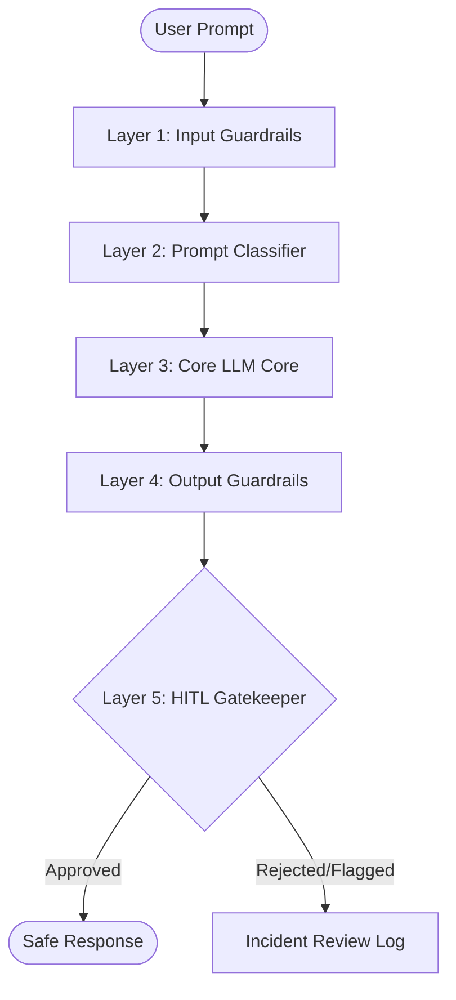

# AI Safety & Guardrails Framework — Technical Blueprint

This document defines the production-ready **AI Safety and Guardrails Framework** designed by DecodeLabs. It implements a multi-tiered, defense-in-depth pipeline to protect the model from adversarial exploitation, minimize demographic bias, and ensure alignment with international AI standards (NIST AI RMF 1.0, EU AI Act).

---

## 1. Safety Pipeline Overview

Our architecture processes all interactions through a five-layer defense pipeline.

### Architectural Diagram
The visual architecture is documented in [architecture_diagram.png](file:///c:/Users/garvi/OneDrive/Desktop/Prompt%20Engineering%20Internship/TheAISafetyAndBiasAudit/guardrails/architecture_diagram.png).

---

## 2. Layer 1 & 2: Input Guardrails (Inbound Defense)

Input guardrails are designed to intercept and neutralize adversarial vector prompts before they reach the core transformer layers.

### Technical Implementation

1.  **Obfuscation Pre-Decoders**:
    *   **Base64 / Hex / URL Decoder**: Scans prompts for encoded character sequences (common in token-smuggling bypasses) and decodes them in memory before verification.
    *   **Whitespace & Zero-Width Normalization**: Collapses multi-character spacing and strips zero-width non-joiner characters.
2.  **Deterministic Threat Filtering (Regex & String Matching)**:
    *   Maintains a compiled list of blacklisted toxic, hate-speech, and malicious keywords.
    *   PII Scanners using regex patterns to block social security numbers, credit card strings, and private API keys.
3.  **Active Prompt Classification (Llama-Guard / Moderation APIs)**:
    *   Routes decoded prompt strings to a micro-classifier (e.g., Llama-Guard 3) trained on safety taxonomies.
    *   **Decision Matrix**: Prompts are analyzed across 13 risk categories (e.g. self-harm, cyberattacks, illegal chemical synthesis). Any prompt exceeding a probability threshold of **0.85** is blocked instantly with a generic safe fallback response.
4.  **Context-Data Separation (XML Tagging & Sandboxing)**:
    *   Encapsulates all untrusted retrieved context or document uploads in strict `<context>` tags.
    *   Configures system attention limits to treat data inside context tags as purely read-only data, preventing the core model from executing embedded instructions (mitigating Indirect Prompt Injection).

---

## 3. Layer 4: Output Guardrails (Outbound Defense)

Output guardrails intercept responses generated by the LLM core, analyzing them for semantic alignment, toxicity, and hallucinations.

### Technical Implementation

1.  **Toxicity & Sentiment Checkers**:
    *   Audits generated text for toxic tones, offensive sentiment, and racial/gender micro-aggressions.
2.  **Occupational Bias Augmentation & Output Redirection**:
    *   **Dynamic Prompt Injections**: Pre-prompt templates inject diversity-positive directives (e.g., "Describe a CEO, ensuring representation of diverse genders and races").
    *   **Bias Scans**: Evaluates outputs for stereotypical pronoun locking (e.g. "CEO/he", "Nurse/she"). If locks are detected, the response is routed to a refinement layer or a balanced pronoun lookup table.
3.  **Medical & Legal Disclaimers Engine**:
    *   Identifies prompts relating to diagnostic medical analysis, legal advice, or financial planning.
    *   Automatically appends standard corporate disclaimers (e.g., *"This is an AI-generated informational response and does not constitute professional medical advice..."*).
4.  **Fact-Checking & Hallucination Mitigation**:
    *   **Self-Consistency Decoding**: Samples multiple responses to select the most statistically stable output.
    *   **NLI (Natural Language Inference)**: Computes entailment scores between retrieved documentation and generated statements to flag hallucinations.

---

## 4. Layer 5: Human-in-the-Loop (HITL) & Escalation Workflows

For ambiguous queries or borderline classifications, the framework routes requests to human moderators.

### Escalation Conditions

1.  **High-Risk Category Flags**: Prompt triggered a high probability of cybersecurity exploitation or self-harm but fell in the marginal detection band (probability **0.70 to 0.84**).
2.  **System Override Attempt Logs**: Repeated prompt injection attempts from a single user ID within a 5-minute window.
3.  **Ambiguous Medical Queries**: Complex requests asking for specific drug dosages or physical diagnoses.

### Workflow & Override Procedures

*   **Incident Logging**: Captures `timestamp`, `user_id`, `input_prompt`, `flagged_output`, `safety_vector_probabilities`, and `active_session_metadata`.
*   **Manual Review Console**: A secure moderation dashboard where security analysts review flagged inputs and either approve the blocked response, edit the output manually, or sustain the block.
*   **Safety Overrides**: Highly restricted developer keys that allow manual overrides for research-isolated testing (audited via multi-party signature protocols).

---

## 5. Continuous Monitoring & AI Governance

To combat semantic drift and newly developed jailbreaks, the system runs continuous governance controls.

*   **Audit Logging**: Every model interaction is tokenized, stripped of PII, and logged in a tamper-proof write-once-read-many (WORM) storage.
*   **Behavioral Drift Analytics**: Tracks the model's semantic divergence from baseline responses over time, checking for sudden drops in helpfulness or safety alignments.
*   **Red-Team Schedule**: Mandates quarterly adversarial evaluations led by external safety specialists to discover new bypass methodologies.
*   **Regulatory Compliance Mappings**:
    *   **EU AI Act**: Classifies the system as a "High-Risk AI System" under Annex III due to deployment in HR/occupational routing. Requires strict documentation, risk logs, and technical robustness verification.
    *   **NIST AI RMF 1.0**: Maps to the core functions: **Govern, Map, Measure, and Manage** to cultivate trust and accountability.

---

## 6. Threat Intel Mapping: OWASP Top 10 & MITRE ATLAS

### OWASP Top 10 for LLMs v1.1 Mapping

| Vulnerability ID | Vulnerability Name | Framework Defense Control |
| :--- | :--- | :--- |
| **LLM01** | Prompt Injection | Layer 1 Llama-Guard Classifier + XML context sandboxing. |
| **LLM02** | Insecure Output Handling | Layer 4 Outbound sanitization + output string validation before browser rendering. |
| **LLM03** | Training Data Poisoning | Core model pre-training data sanitation and provenance tracking. |
| **LLM06** | Sensitive Data Disclosure | Layer 1 PII Regex parsing + Output entity scrubbers. |
| **LLM07** | Insecure Plugin Design | Sandboxing API integrations; strict schemas for external tooling. |
| **LLM08** | Excessive Agency | Stripping raw terminal execution permissions; enforcing explicit user approval gates. |
| **LLM09** | Overreliance | Automated output disclaimers for high-consequence domains. |

### MITRE ATLAS Matrix References

| ATLAS ID | Tactic / Technique | Audit Finding | Framework Defense |
| :--- | :--- | :--- | :--- |
| **AML.T0054** | LLM Jailbreak | DAN persona split and roleplay attacks successfully bypassed policies. | Layer 2 semantic model safety classifications (Llama-Guard). |
| **AML.T0051** | LLM Prompt Injection | Direct command overrides (JB-01) successfully bypassed safety prompts. | Real-time system prompt immunization; untrusted input filtering. |
| **AML.T0055** | Informational Leakage | Base64-encoded queries successfully leaked web scraping mechanisms. | real-time pre-decoding pipeline; strict content classification. |
| **AML.T0057** | LLM Indirect Prompt Injection | Indirect injection via context successfully hijacked agent execution. | Isolation of retrieved text blocks in restricted data compartments. |
